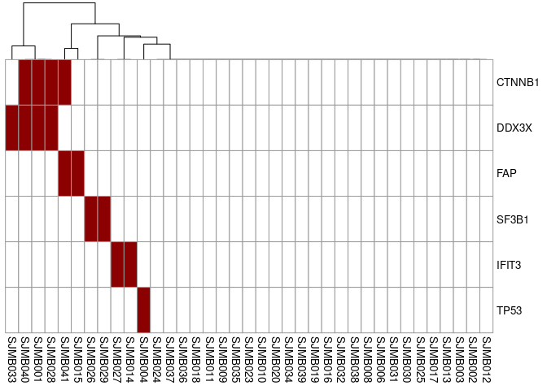
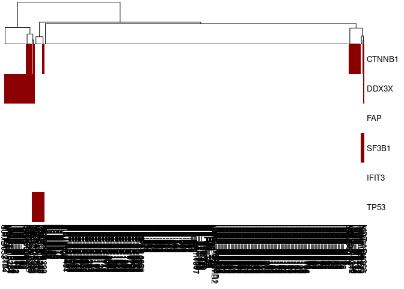
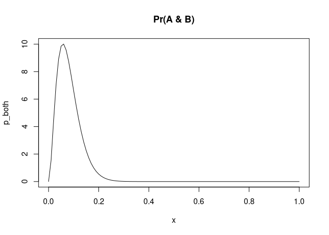
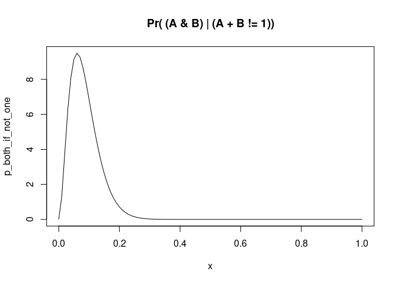
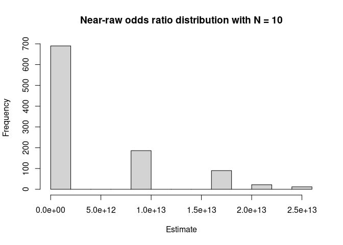
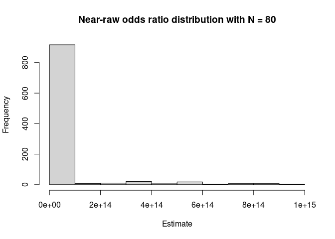
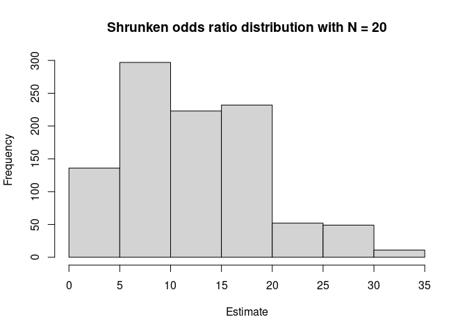
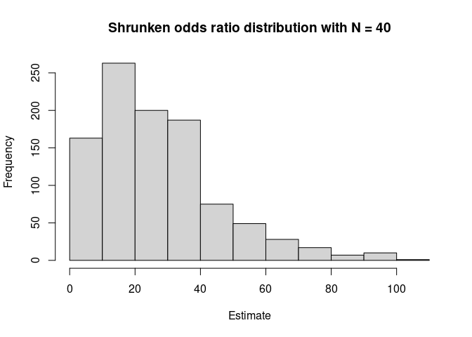
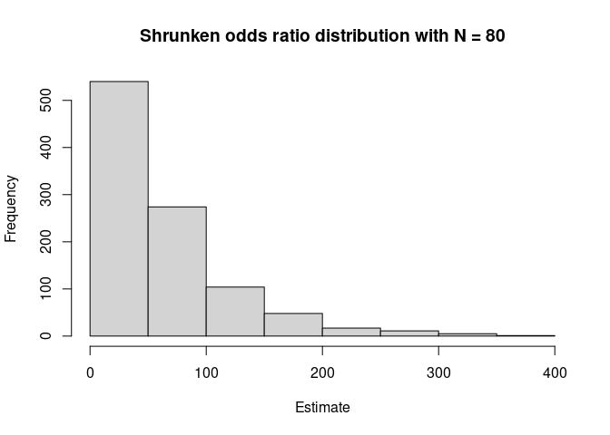

# Automating cBioPortal queries

## An unpackaged Rmarkdown example

This document pulls some data from [cBioPortal](https://cbioportal.org/) via `cgdsr`,
and performs a bit of analysis on it.  (A separate example exists for slides,
as with a 5-minute presentation.) Let's begin by looking at medulloblastoma,
a mostly-pediatric tumor of the medulla oblongata, or lower brainstem. We will 
pull a small study from [cBioPortal](https://cBioPortal.org) and then see how the
estimate of co-mutation odds for two genes hold up in a much larger study. 

## Medulloblastoma background information

[A recent paper from Volker Hovestadt](https://www.nature.com/articles/s41586-019-1434-6) 
provides some more details on the features of these tumors, which have (like most
childhood brain cancers) been an object of intense study (including at VAI). Of 
note, Hedgehog signaling, Wnt signaling, and a constellation of alterations lumped
together via DNA methylation profiling as "Group 3" and "Group 4" define the WHO 
subtypes of medulloblastoma among patients thus far characterized.

## cBioPortal data via the `cgdsr` package 

Let's pull some data from cBioPortal using the [cgdsr](https://cran.r-project.org/web/packages/cgdsr/index.html) package and
see what studies are available for this disease.

The first step is to  create a CGDS (Cancer Genome Data Server)
object to manage cBioPortal queries.

<details>
  <summary>Load required libraries</summary>

```r
library(cgdsr)
```

```
## Please send questions to cbioportal@googlegroups.com
```

```r
library(tidyverse)
```

```
## ── Attaching packages ─────────────────────────────────────── tidyverse 1.3.1 ──
```

```
## ✓ ggplot2 3.3.5     ✓ purrr   0.3.4
## ✓ tibble  3.1.6     ✓ dplyr   1.0.7
## ✓ tidyr   1.1.4     ✓ stringr 1.4.0
## ✓ readr   2.1.1     ✓ forcats 0.5.1
```

```
## ── Conflicts ────────────────────────────────────────── tidyverse_conflicts() ──
## x dplyr::filter() masks stats::filter()
## x dplyr::lag()    masks stats::lag()
```

```r
library(kableExtra)
```

```
## 
## Attaching package: 'kableExtra'
```

```
## The following object is masked from 'package:dplyr':
## 
##     group_rows
```

```r
library(pheatmap)
library(janitor)
```

```
## 
## Attaching package: 'janitor'
```

```
## The following objects are masked from 'package:stats':
## 
##     chisq.test, fisher.test
```
</details>


```r
mycgds <- CGDS("http://www.cbioportal.org/")
show(mycgds)
```

```
## [1] "CGDS: 0x55be020a1528"
```

That's not terribly useful. Let's ask the cBioPortal object what studies we can query. 


```r
studies <- getCancerStudies(mycgds)
glimpse(studies)
```

```
## Rows: 333
## Columns: 3
## $ cancer_study_id <chr> "paac_jhu_2014", "mel_tsam_liang_2017", "all_stjude_20…
## $ name            <chr> "Acinar Cell Carcinoma of the Pancreas (JHU, J Pathol …
## $ description     <chr> "Whole exome sequencing of 23 surgically resected panc…
```

Much better.  It looks like there are 333 studies to choose from at the moment.

## Fetching medulloblastoma studies 

Let's narrow our field down to the ones that involve medulloblastoma. When we
loaded the `tidyverse` package, it also loaded `stringr`, which gives us a way
to filter data frames or tibbles based on whether a column matches a string. 


```r
getCancerStudies(mycgds) %>% 
  filter(str_detect(name, "Medulloblastoma")) %>% 
  select(cancer_study_id, name) %>% 
  kbl() %>% 
  kable_styling(bootstrap_options = c("striped", "hover"))
```

<table class="table table-striped table-hover" style="margin-left: auto; margin-right: auto;">
 <thead>
  <tr>
   <th style="text-align:left;"> cancer_study_id </th>
   <th style="text-align:left;"> name </th>
  </tr>
 </thead>
<tbody>
  <tr>
   <td style="text-align:left;"> mbl_broad_2012 </td>
   <td style="text-align:left;"> Medulloblastoma (Broad, Nature 2012) </td>
  </tr>
  <tr>
   <td style="text-align:left;"> mbl_dkfz_2017 </td>
   <td style="text-align:left;"> Medulloblastoma (DKFZ, Nature 2017) </td>
  </tr>
  <tr>
   <td style="text-align:left;"> mbl_icgc </td>
   <td style="text-align:left;"> Medulloblastoma (ICGC, Nature 2012) </td>
  </tr>
  <tr>
   <td style="text-align:left;"> mbl_pcgp </td>
   <td style="text-align:left;"> Medulloblastoma (PCGP, Nature 2012) </td>
  </tr>
  <tr>
   <td style="text-align:left;"> mbl_sickkids_2016 </td>
   <td style="text-align:left;"> Medulloblastoma (Sickkids, Nature 2016) </td>
  </tr>
</tbody>
</table>

It would be nice to find out how many samples are in each study. It turns out that
this can be found in the `description` column via a bit of chicanery (i.e., throwing
out anything in the description that isn't a number).  No guarantees that this will 
always work for other studies -- use this at your own risk!  As a bonus, let's order
the studies from smallest to largest.


```r
getCancerStudies(mycgds) %>% 
  filter(str_detect(name, "Medulloblastoma")) %>% 
  mutate(n = as.integer(str_extract(description, "[0-9]+"))) %>% 
  select(cancer_study_id, n, name) %>% 
  arrange(n) %>% 
  kbl() %>% 
  kable_styling(bootstrap_options = c("striped", "hover"))
```

<table class="table table-striped table-hover" style="margin-left: auto; margin-right: auto;">
 <thead>
  <tr>
   <th style="text-align:left;"> cancer_study_id </th>
   <th style="text-align:right;"> n </th>
   <th style="text-align:left;"> name </th>
  </tr>
 </thead>
<tbody>
  <tr>
   <td style="text-align:left;"> mbl_pcgp </td>
   <td style="text-align:right;"> 37 </td>
   <td style="text-align:left;"> Medulloblastoma (PCGP, Nature 2012) </td>
  </tr>
  <tr>
   <td style="text-align:left;"> mbl_sickkids_2016 </td>
   <td style="text-align:right;"> 46 </td>
   <td style="text-align:left;"> Medulloblastoma (Sickkids, Nature 2016) </td>
  </tr>
  <tr>
   <td style="text-align:left;"> mbl_broad_2012 </td>
   <td style="text-align:right;"> 92 </td>
   <td style="text-align:left;"> Medulloblastoma (Broad, Nature 2012) </td>
  </tr>
  <tr>
   <td style="text-align:left;"> mbl_icgc </td>
   <td style="text-align:right;"> 125 </td>
   <td style="text-align:left;"> Medulloblastoma (ICGC, Nature 2012) </td>
  </tr>
  <tr>
   <td style="text-align:left;"> mbl_dkfz_2017 </td>
   <td style="text-align:right;"> 491 </td>
   <td style="text-align:left;"> Medulloblastoma (DKFZ, Nature 2017) </td>
  </tr>
</tbody>
</table>

This is encouraging. The Hovestadt paper I mentioned above (where the DKFZ folks
looked at single-cell data from human and mouse) is a follow-up to one with 491
cases! (Most of the time, the Germans have the most samples. The big exception
to this is TARGET liquid tumors: we take pride in dwarfing their cohorts.)

## Fetching case lists to collate mutations and other aberrations 

For the sake of simplicity, let's start with the Pediatric Cancer Genome Project (PCGP)
medulloblastoma study and its 37 subjects. `getCaseLists(CGDS, cancerStudy)` does that:


```r
mbl_study <- "mbl_pcgp"

# the IDs of the cases in the PCGP MBL study
getCaseLists(mycgds, cancerStudy=mbl_study) %>% 
  filter(case_list_name == "Samples with mutation data") ->
    mbl_caselists


# grab the list of lesions
getGeneticProfiles(mycgds, mbl_study) %>% 
  filter(genetic_profile_name == "Mutations") %>% 
  pull(genetic_profile_id) ->
    mbl_mutations_profile

# a few "greatest hits" mutations seen in MBL
mbl_genes <- c("CTNNB1", "DDX3X", "FAP", "SF3B1", "IFIT3", "TP53")

# get the mutations data and tidy it up
get_muts <- function(x, genes, ...) {
  
  muts <- getProfileData(x, genes, ...)
  is.na(muts) <- (muts == "NaN")
  muts[is.na(muts)] <- 0
  muts[muts != 0] <- 1  
  rn <- rownames(muts)
  muts <- data.frame(lapply(muts, as.integer))
  rownames(muts) <- rn
  return(muts[, genes])
  
}

# We throw out the nature of the mutation here, which is rarely a wise idea (if ever)
muts <- get_muts(mycgds, 
                 mbl_genes, 
                 geneticProfiles=mbl_mutations_profile, 
                 caseList=mbl_caselists$case_list_id)

muts %>% 
  filter(rowSums(.) > 0) %>%
  t() %>%
  kbl() %>% 
  kable_styling(bootstrap_options = c("striped", "hover"))
```

<table class="table table-striped table-hover" style="margin-left: auto; margin-right: auto;">
 <thead>
  <tr>
   <th style="text-align:left;">   </th>
   <th style="text-align:right;"> SJMB041 </th>
   <th style="text-align:right;"> SJMB001 </th>
   <th style="text-align:right;"> SJMB028 </th>
   <th style="text-align:right;"> SJMB040 </th>
   <th style="text-align:right;"> SJMB004 </th>
   <th style="text-align:right;"> SJMB033 </th>
   <th style="text-align:right;"> SJMB027 </th>
   <th style="text-align:right;"> SJMB014 </th>
   <th style="text-align:right;"> SJMB015 </th>
   <th style="text-align:right;"> SJMB026 </th>
   <th style="text-align:right;"> SJMB029 </th>
  </tr>
 </thead>
<tbody>
  <tr>
   <td style="text-align:left;"> CTNNB1 </td>
   <td style="text-align:right;"> 1 </td>
   <td style="text-align:right;"> 1 </td>
   <td style="text-align:right;"> 1 </td>
   <td style="text-align:right;"> 1 </td>
   <td style="text-align:right;"> 0 </td>
   <td style="text-align:right;"> 0 </td>
   <td style="text-align:right;"> 0 </td>
   <td style="text-align:right;"> 0 </td>
   <td style="text-align:right;"> 0 </td>
   <td style="text-align:right;"> 0 </td>
   <td style="text-align:right;"> 0 </td>
  </tr>
  <tr>
   <td style="text-align:left;"> DDX3X </td>
   <td style="text-align:right;"> 0 </td>
   <td style="text-align:right;"> 1 </td>
   <td style="text-align:right;"> 1 </td>
   <td style="text-align:right;"> 1 </td>
   <td style="text-align:right;"> 0 </td>
   <td style="text-align:right;"> 1 </td>
   <td style="text-align:right;"> 0 </td>
   <td style="text-align:right;"> 0 </td>
   <td style="text-align:right;"> 0 </td>
   <td style="text-align:right;"> 0 </td>
   <td style="text-align:right;"> 0 </td>
  </tr>
  <tr>
   <td style="text-align:left;"> FAP </td>
   <td style="text-align:right;"> 1 </td>
   <td style="text-align:right;"> 0 </td>
   <td style="text-align:right;"> 0 </td>
   <td style="text-align:right;"> 0 </td>
   <td style="text-align:right;"> 0 </td>
   <td style="text-align:right;"> 0 </td>
   <td style="text-align:right;"> 0 </td>
   <td style="text-align:right;"> 0 </td>
   <td style="text-align:right;"> 1 </td>
   <td style="text-align:right;"> 0 </td>
   <td style="text-align:right;"> 0 </td>
  </tr>
  <tr>
   <td style="text-align:left;"> SF3B1 </td>
   <td style="text-align:right;"> 0 </td>
   <td style="text-align:right;"> 0 </td>
   <td style="text-align:right;"> 0 </td>
   <td style="text-align:right;"> 0 </td>
   <td style="text-align:right;"> 0 </td>
   <td style="text-align:right;"> 0 </td>
   <td style="text-align:right;"> 0 </td>
   <td style="text-align:right;"> 0 </td>
   <td style="text-align:right;"> 0 </td>
   <td style="text-align:right;"> 1 </td>
   <td style="text-align:right;"> 1 </td>
  </tr>
  <tr>
   <td style="text-align:left;"> IFIT3 </td>
   <td style="text-align:right;"> 0 </td>
   <td style="text-align:right;"> 0 </td>
   <td style="text-align:right;"> 0 </td>
   <td style="text-align:right;"> 0 </td>
   <td style="text-align:right;"> 0 </td>
   <td style="text-align:right;"> 0 </td>
   <td style="text-align:right;"> 1 </td>
   <td style="text-align:right;"> 1 </td>
   <td style="text-align:right;"> 0 </td>
   <td style="text-align:right;"> 0 </td>
   <td style="text-align:right;"> 0 </td>
  </tr>
  <tr>
   <td style="text-align:left;"> TP53 </td>
   <td style="text-align:right;"> 0 </td>
   <td style="text-align:right;"> 0 </td>
   <td style="text-align:right;"> 0 </td>
   <td style="text-align:right;"> 0 </td>
   <td style="text-align:right;"> 1 </td>
   <td style="text-align:right;"> 0 </td>
   <td style="text-align:right;"> 0 </td>
   <td style="text-align:right;"> 0 </td>
   <td style="text-align:right;"> 0 </td>
   <td style="text-align:right;"> 0 </td>
   <td style="text-align:right;"> 0 </td>
  </tr>
</tbody>
</table>

That's rather a lot to digest even if we do toss out the cases without detected
mutations.  Perhaps we'd be well served by plotting the data instead. 


## Plotting (some of) the results from our query

You can also embed plots, for example a sort-of-oncoprint of this study:

<!-- -->

This is rather informative, in that one can often pick up patterns of mutual 
exclusivity between groups of subjects and groups of genes. In the case of
medulloblastoma, the WHO subgroups of the tumor are _Wnt_ (primarily driven by
beta-catenin, aka _CTNNB1_, or _APC_ mutations), _Shh_ (primarily driven by _PTCH1_
or sometimes structural variants), _Group 3_, and _Group 4_, where the latter don't
have one defining class of driver mutation.  We note that in this small 2012 study,
it is hard to tell which of the latter is which (later resolved by DNA methylation).
(The WHO classification of medulloblastoma came about in 2016, for what it's worth.)

Based on our earlier plot, we might wonder whether the beta-catenin gene and
the _DDX3X_ X-linked helicase gene are co-mutated. We can test this similarly
to our previous adventures in mutual exclusivity with IDH1, IDH2, TET2, and WT1:


```r
message("Chi-squared p-value:", appendLF = FALSE)
```

```
## Chi-squared p-value:
```

```r
muts %>% 
  tabyl(CTNNB1, DDX3X) %>% 
  chisq.test(simulate.p.value = TRUE) %>% 
  getElement("p.value")
```

```
## [1] 0.002498751
```

```r
message("Fisher's exact test p-value:", appendLF = FALSE)
```

```
## Fisher's exact test p-value:
```

```r
muts %>% 
  tabyl(CTNNB1, DDX3X) %>% 
  fisher.test(simulate.p.value = TRUE) %>% 
  getElement("p.value")
```

```
## [1] 0.002013778
```
# Power, sample size, and variance

## More is not better, better is better...

I once spent a summer in Italy, eating much smaller meals but still feeling full.
Italians (or Genovese, at least) are fond of reminding Americans that _di più non è meglio_;
_meglio è meglio. ("More is not better; better is better.") And from a statistical 
standpoint, this is usually true: a small, well-executed survey or experiment can
beat the pants off of a huge, poorly-executed survey or experiment. (Xiao-Li Meng 
at Harvard has dubbed this _the curse of Big Data_, although it's really more of
a curse of crappy and/or perversely incentivized experiments). Nevertheless...

## ...but more of the same is often good enough

If we *can* get *more* observations and at the same time *better* observations, 
it would be rather silly not to. Doubly so when it's free! So let's do that. 

Our earlier observations of co-operating mutations seemed _highly significant_!
And in fact they're striking in the figure (see the importance of figures?).
But will they replicate when we look at the same genes in a bigger study? 
(Don't peek at the Northcott paper if you can help it. It's more fun this way.)


```r
northcott <- "mbl_dkfz_2017"

getCaseLists(mycgds, northcott) %>% 
  filter(case_list_name == "Samples with mutation data") ->
    northcott_caselists 

# grab the list of lesions
getGeneticProfiles(mycgds, northcott) %>% 
  filter(genetic_profile_name == "Mutations") %>% 
  pull(genetic_profile_id) ->
    northcott_mutations_profile

# grab the mutation matrix for the genes as before
northcott_muts <- get_muts(mycgds,      # as before
                           mbl_genes,   # as before 
                           northcott_mutations_profile, 
                           northcott_caselists$case_list_id)

# out of curiosity, how many of each mutation do we see here? 
colSums(northcott_muts)
```

```
## CTNNB1  DDX3X    FAP  SF3B1  IFIT3   TP53 
##     32     43      0      5      0     17
```

Looks like we're all set to replicate our previous results.


```r
message("Chi-squared p-value (Northcott):", appendLF = FALSE)
```

```
## Chi-squared p-value (Northcott):
```

```r
northcott_muts %>% 
  tabyl(CTNNB1, DDX3X) %>% 
  chisq.test(simulate.p.value = TRUE) %>% 
  getElement("p.value")
```

```
## [1] 0.0004997501
```

```r
message("Fisher's exact test p-value (Northcott):", appendLF = FALSE)
```

```
## Fisher's exact test p-value (Northcott):
```

```r
northcott_muts %>% 
  tabyl(CTNNB1, DDX3X) %>% 
  fisher.test(simulate.p.value = TRUE) %>% 
  getElement("p.value")
```

```
## [1] 2.770184e-06
```

Wow!  Looks like we've replicated our original finding!
I'll bet this will look super cool when we plot it. 


```r
# let's use pheatmap again
pheatmap(t(data.matrix(northcott_muts)), col=c("white", "darkred"), cluster_rows=FALSE,
         clustering_distance_cols="manhattan", clustering_method="ward.D2", legend=FALSE)
```

<!-- -->

Well, that looks a bit different, doesn't it?
They're there, but maybe not as overlappy as before.
Say... are some samples from the original PCGP?


```r
northcott_caselists %>% 
  pull(case_ids) %>% 
  str_split(pattern=" ") %>% 
  getElement(1) -> 
    northcott_cases

mbl_caselists %>%
  pull(case_ids) %>% 
  str_split(pattern=" ") %>% 
  getElement(1) ->
    stjude_cases

intersect(northcott_cases, stjude_cases)
```

```
##  [1] "SJMB001" "SJMB002" "SJMB003" "SJMB004" "SJMB006" "SJMB008" "SJMB009"
##  [8] "SJMB010" "SJMB011" "SJMB012" "SJMB013" "SJMB014" "SJMB015" "SJMB016"
## [15] "SJMB017" "SJMB018" "SJMB019" "SJMB020" "SJMB023" "SJMB024" "SJMB025"
## [22] "SJMB026" "SJMB027" "SJMB028" "SJMB029" "SJMB030" "SJMB031" "SJMB032"
## [29] "SJMB033" "SJMB034" "SJMB035" "SJMB036" "SJMB037" "SJMB038" "SJMB039"
## [36] "SJMB040" "SJMB041" ""
```

Whoops.  Better drop those for the replication, eh? 


```r
northcott_only <- setdiff(northcott_cases, stjude_cases)

northonly_muts <- get_muts(mycgds,      # as before
                           mbl_genes,   # as before 
                           geneticProfiles=northcott_mutations_profile,
                           cases=northcott_only)
```

(This is a recurrent issue with cBioPortal studies -- you just have to check.)
Is the association still statistically significant? 


```r
message("Chi-squared p-value (Northcott ONLY):", appendLF = FALSE)
```

```
## Chi-squared p-value (Northcott ONLY):
```

```r
northonly_muts %>% 
  tabyl(CTNNB1, DDX3X) %>% 
  chisq.test(simulate.p.value = TRUE) %>% 
  getElement("p.value")
```

```
## [1] 0.0009995002
```

```r
message("Fisher's exact test p-value (Northcott ONLY):", appendLF = FALSE)
```

```
## Fisher's exact test p-value (Northcott ONLY):
```

```r
northonly_muts %>% 
  tabyl(CTNNB1, DDX3X) %>% 
  fisher.test(simulate.p.value = TRUE) %>% 
  getElement("p.value")
```

```
## [1] 0.0002105828
```

Yes it is.  But is the odds ratio for co-occurrence in the same ballpark? 


```r
muts %>% 
  tabyl(CTNNB1, DDX3X) %>% 
  fisher.test() %>% 
  getElement("estimate") -> 
    StJ_estimate

northonly_muts %>% 
  tabyl(CTNNB1, DDX3X) %>% 
  fisher.test() %>% 
  getElement("estimate") ->
    northcott_estimate

message("Co-occurrence odds ratio (St. Jude cases): ", round(StJ_estimate, 3))
```

```
## Co-occurrence odds ratio (St. Jude cases): 62.548
```

```r
message("Co-occurrence odds ratio (DKFZ cases): ", round(northcott_estimate, 3))
```

```
## Co-occurrence odds ratio (DKFZ cases): 6.207
```

```r
message("Effect size inflation, St. Jude vs. Northcott: ",
        round(StJ_estimate / northcott_estimate), "x")
```

```
## Effect size inflation, St. Jude vs. Northcott: 10x
```

The estimate from the St. Jude's study is *ten times* as large as from Northcott's. 


# The winner's curse and replication 

It turns out this happens a lot. It's rarely intentional (see above).
Early results in small studies can over- or under-estimate effect sizes
(and, sometimes, significance or sign) relative to larger or later studies.
(Unfortunately, the later studies almost invariably do not make the news.)

Recent work has quantified [the many challenges of replicating scientific research](https://elifesciences.org/articles/67995), particularly
[the difficulty of interpreting the results](https://elifesciences.org/articles/71601)
when all is said and done. In short, just over a quarter of high-profile cancer
biology studies that the authors tried to replicate could be started at all. Of 
those that could be reproduced, about half replicated. Already in this class, we've
seen at least one result that _could not possibly have been interpreted as significant_ (because it was literal experimental noise) cited over 1000 times as justification for continuing to parrot the same nonsense. Usually the problems are a bit more subtle, and sometimes they're just bad luck. More specifically, regression to the mean.

## Regression to the mean 

[Regression to the mean](https://www.stevejburr.com/post/scatter-plots-and-best-fit-lines/) 
describes the tendency of successive estimates, particularly from small samples, 
to over- and under-shoot the true effect sizes. This cuts both ways: usually in
biology and medicine we worry about overestimates of effect sizes, but smallish 
experiments can also underestimate important effects. Depending on incentives,
one or the other may be more desirable than a consistent estimate of modest size.

This is not limited to experimental biology; it can be readily seen in 
[the gold standard in biomedical research, the randomized clinical trial](https://www.bmj.com/content/346/bmj.f2304). In short, if you run under-
powered experiments, most of the time you'll miss an effect even if it's there, 
but sometimes you'll wildly overestimate. Neither of these are good things.


# Simulations, power, and reducing the variance of estimates 

Let's make this concrete with some simulations.  We'll adjust the effect size 
slightly for co-mutations of _CTNNB1_ and _DDX3X_ in medulloblastoma, then run
some simulations at various sample sizes to see what we see. (You can also use
an analytical estimate via `power.prop.test` and similar, but for better or worse,
simulating from a noisy generating process is about the same amount of work for 
powering Fisher's test, as is the case for many tests of significance, as in trials.)

In order to take into account uncertainty (proposing that we found what we found
in the original PCGP study and wanted to estimate the odds of seeing it again), 
we'll use the [beta distribution](http://varianceexplained.org/statistics/beta_distribution_and_baseball/) to capture a "noisy" estimate of a proportion.  Specifically, let's
use the original mutation table to estimate each from the PCGP data. 


```r
neither <- nrow(subset(muts, CTNNB1 == 0 & DDX3X == 0))
CTNNB1 <- nrow(subset(muts, CTNNB1 == 1 & DDX3X == 0))
DDX3X <- nrow(subset(muts, CTNNB1 == 0 & DDX3X == 1))
both <- nrow(subset(muts, CTNNB1 == 1 & DDX3X == 1))
```

Now we have all we really need to simulate. Formally, we will model it like so.

* For each sample, we simulate the occurrence of _one_ mutation.
* If a sample has _one_ mutation, we simulate which one (CTNNB1 or DDX3X).
* If a sample has fewer or more than _one_ mutation, we simulate which.

We can do this repeatedly to estimate the distribution of test
statistics to expect if we run this experiment quite a few times,
with both smaller and larger total sample sizes. We're assuming that
the dependency structure is fairly stable (is this reasonable?). 

The `Beta(a, b)` distribution above is continuous between 0 and 1, and its shape depends
on the values of `a` and `b`. For example, we can plot each of the above using the 
St. Jude's-derived values to get a feel for how "mushy" our guesses are given
the number of samples in the St Jude PCGP study. Effectively, we propagate our 
underlying uncertainty about parameters by drawing them from a sensible generator,
and that sensible generator is a beta distribution reflecting our sample size. 


```r
a <- CTNNB1
b <- DDX3X 

p_one <- function(x) dbeta(x, (a + b), (both + neither))
p_both <- function(x) dbeta(x, both, (a + b + neither))
p_both_if_not_one <- function(x) dbeta(x,  both, neither)

plot(p_one, main="Pr(A|B & !(A & B))")
```

<!-- -->

```r
plot(p_both, main="Pr(A & B)")
```

<!-- -->

```r
plot(p_both_if_not_one, main="Pr( (A & B) | (A + B != 1))")
```

<!-- -->

Now for `n` samples, we can simulate appropriately "noisy" 2x2 tables with that many subjects.


```r
sim2x2 <- function(n, neither, a, b, both) {

  p_one <- rbeta(1, (a + b), (both + neither))
  p_both <- rbeta(1, both, neither)
  p_a <- rbeta(1, a, b)
  
  n_a_b <- rbinom(1, n, p_one)
  n_neither_both <- n - n_a_b
  n_both <- rbinom(1, n_neither_both, p_both)
  n_neither <- n_neither_both - n_both
  n_a <- rbinom(1, n_a_b, p_a)
  n_b <- n_a_b - n_a

  as.table(matrix(c(n_neither, n_a, n_b, n_both), nrow=2))
  
}
```

Let's give it a shot.


```r
a <- CTNNB1
b <- DDX3X 

sim2x2(n=nrow(muts), neither, a, b, both)
```

```
##    A  B
## A 29  2
## B  2  4
```

That seems to work fine (we could more directly simulate the odds of neither+either and a+b, feel free to implement that instead). If you want an analytical estimate for an asymptotic 
test (`prop.test`), R also provides that, but beware: it doesn't really take into account 
sampling variance (i.e. uncertainty about the parameter estimates). Let's do that ourselves.


```r
# fairly generic 
simFisher <- function(n, neither, a, b, both) fisher.test(sim2x2(n, neither, a, b, both))

# using the values we've already set up to simulate from: 
simFetP <- function(n) simFisher(n, neither, a, b, both)$p.value
```

The `replicate` function is quite helpful here. Let's suppose the St. Jude 
study is representative of medulloblastoma generally. We'll simulate 1000 
studies of sizes between 10 and 500 to see how often our (true!) difference
in proportions registers as significant at p < 0.05. 


```r
powerN <- function(n, alpha=0.05) {
  res <- table(replicate(1000, simFetP(n=n)) < alpha)
  res["TRUE"] / sum(res)
}

for (N in c(10, 30, 50, 100, 300, 500)) {
  message("Power at alpha = 0.05 with n = ", N, ": ", powerN(N) * 100, "%")
}
```

```
## Power at alpha = 0.05 with n = 10: 16%
```

```
## Power at alpha = 0.05 with n = 30: 67.3%
```

```
## Power at alpha = 0.05 with n = 50: 83.9%
```

```
## Power at alpha = 0.05 with n = 100: 94.4%
```

```
## Power at alpha = 0.05 with n = 300: 99.4%
```

```
## Power at alpha = 0.05 with n = 500: 99.4%
```
_Question_: What's the estimated power with a sample size of 37? 

<details>
  <summary>Click here for an answer</summary>

```r
   message("Power at alpha = 0.05 with n = ", 37, ": ", powerN(37) * 100, "%")
```

```
## Power at alpha = 0.05 with n = 37: 73.5%
```
</details>

_Question_: How does that compare to `power.prop.test` with p1 = (neither+both)/(all),
p2 = (CTNNB1only + DDX3Xonly)/(all), and n=37? Does this seem like and over- or under-
estimate relative to Fisher's exact test (above)?

<details>
  <summary>Click here for an answer</summary>

```r
  power.prop.test(n=37, p1=(35/37), p2=(2/37))
```

```
## 
##      Two-sample comparison of proportions power calculation 
## 
##               n = 37
##              p1 = 0.9459459
##              p2 = 0.05405405
##       sig.level = 0.05
##           power = 1
##     alternative = two.sided
## 
## NOTE: n is number in *each* group
```
</details>

For reasons we'll see shortly, I find the above to be a gross overestimate. 
What about our odds ratio estimates? Do they hop around all over the place?
Let's add a pseudocount to the shrunken odds ratio estimator to stabilize them.


```r
# how wild are our odds ratios at a given N?
shrinkOR <- function(n, pseudo=2) {
  res <- sim2x2(n, neither, a, b, both) + pseudo
  odds <- (res[1,1] * res[2,2]) / (res[1,2] * res[2,1])
  return(odds)
}

OR0 <- function(n) replicate(1000, shrinkOR(n, pseudo=1e-6))

for (N in c(10, 20, 40, 80)) {
  hist(OR0(n=N), xlab="Estimate", main=paste("Near-raw odds ratio distribution with N =", N))
}
```

<!-- --><!-- --><!-- --><!-- -->

```r
# And if we shrink a bit (i.e., apply a prior)?
ORs <- function(n) replicate(1000, shrinkOR(n))

for (N in c(10, 20, 40, 80)) {
  hist(ORs(n=N), xlab="Estimate", main=paste("Shrunken odds ratio distribution with N =", N))
}
```

<!-- --><!-- --><!-- --><!-- -->

(Some of you may already know the log-odds ratio trick to turn the above into a bell curve.
If not, try re-plotting the histograms above, but using the log of the OR estimates.)

The tails of the estimates are pretty long, but the mass concentrates quickly near the true
parameter estimate. (This is also why resampling approaches can help stabilize estimates:
if you have enough data to estimate a parameter, resampling can also estimate how fragile 
your estimates are, and therefore how trustworthy they are. That's why we bootstrap.) 


# Thoughts and questions

* Run `with(muts, table(CTNNB1, DDX3X)) %>% fisher.test`.  What does the 95% CI represent?

* Fisher's exact test is a special case of hypergeometric testing. What others exist? 
What are these tests typically used for, and what assumptions are made regarding categories?

* What happens if you test multiple hypotheses, or apply multiple tests of the same?

* Does it matter which correction method in `p.adjust` you use to correct if you do?

* Is there a situation in cancer genetic epidemiology where the FWER would make more 
sense than the FDR (i.e., where you want to bound the probability of any false positives)?

* Can you rig up a simulation where the cost for a false negative is much greater than for 
a false positive, and tally up the results of various `p.adjust` methods in this situation?

* Can you rig up a simulation where the cost for a false positive is much greater than for 
a false negative, and tally up the results of various `p.adjust` schemes for that? 

* (Nontrivial) How would you adjust this for a 2x3 or 3x2 table like in Wang et al. 2014?

* (Nontrivial) How does the addition of a pseudocount stabilize the variance of estimates? What is being traded away when we do this, and is it (typically) a worthwhile trade?
